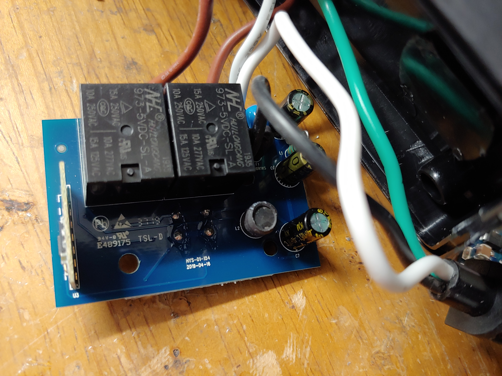
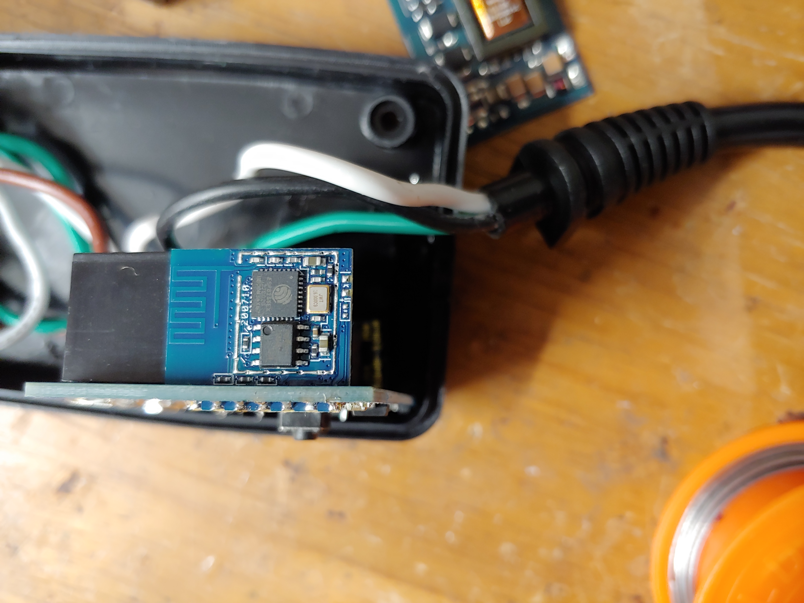

# Aoycocr 2AKBP-X13

The device has 2 indicator LEDs under the button and 2 indiviually controllable outlets.

[FCC filing](https://fccid.io/2AKBP-X13/)

[Tasmato](https://templates.blakadder.com/aoycocr_X13.html) wiki mentioned that it might not be able to use Tuya-Convert.


## Teardown

Removing the 3 screws at the back and opening the case revealed a single PCB with 2 relays and a single ESP module.





The ESP module is ESP8266-S3 and the [FCC filing](https://fccid.io/2AKBPESP8266-S3/Users-Manual/User-Manual-3594791) provided the pins

1. EN
2. TOUT
3. GPIO14
4. GPIO14
5. GPIO13
6. GPIO15
7. GPIO0
8. GPIO2
9. GPIO4
10. GPIO 5
11. RX
12. TX
13. VCC
14. GND

The pins are on alternate sides:

```
1  3  5  7  9  11  13
2  4  6  8  10 12  14
```

The GPIOs being used are:
* LED#1:  GPIO0, inverted
* LED#2:  GPIO2, inverted
* Button: GPIO13
* Relay1: GPIO15
* Relay2: GPIO12

I soldered some wires directly to the pins to flash it.