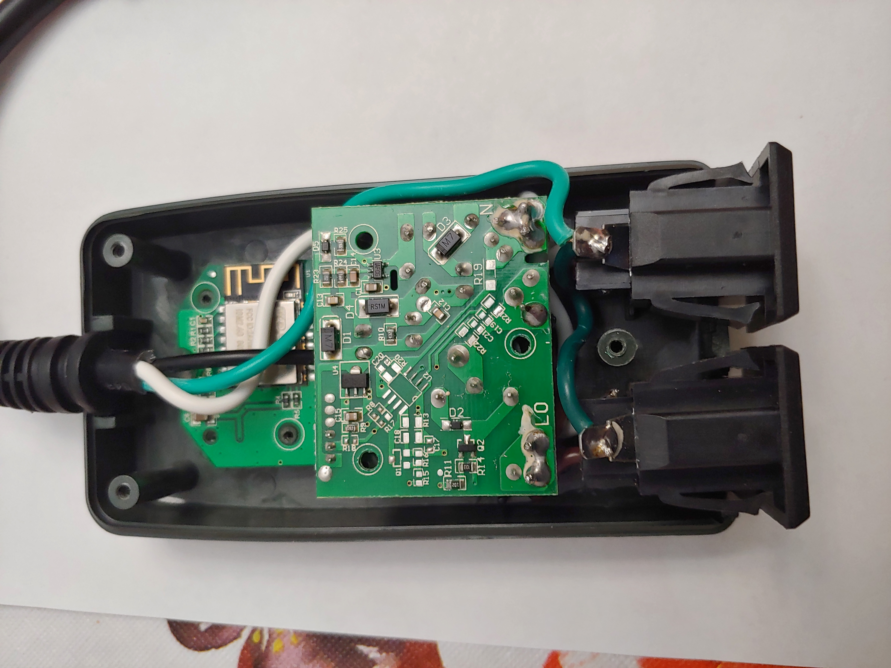
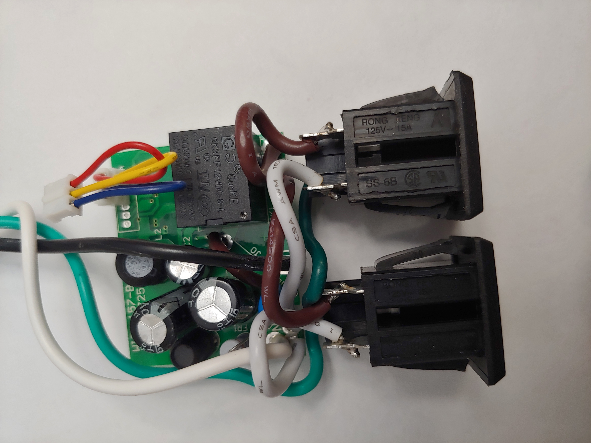
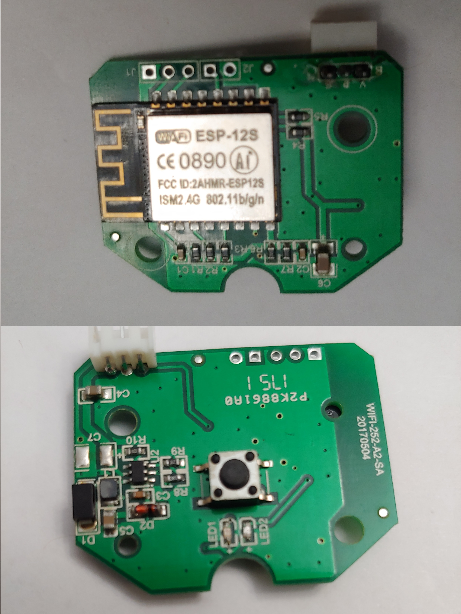

# Houzetek RF251

The device has 2 indicator LEDs under the button and 2 outlets; the outlets cannot be individually controlled.

## Teardown

Removing the 3 screws at the back and opening the case revealed 2 neatly laid out PCBs. One housed the relay and high voltage supply components and the other contained an ESP-12S and 3.3V supply components. The supply provided by the main board was 12V.

The GPIOs being used are:
* LED#1:  GPIO13, inverted
* LED#2:  GPIO5, inverted
* Button: GPIO14, INPUT_PULLUP
* Relay: GPIO12

There were an unpopulated serial tag with pinouts (from left: Gnd, Tx, Rx, GPIO0) and I used it to flash the device. 